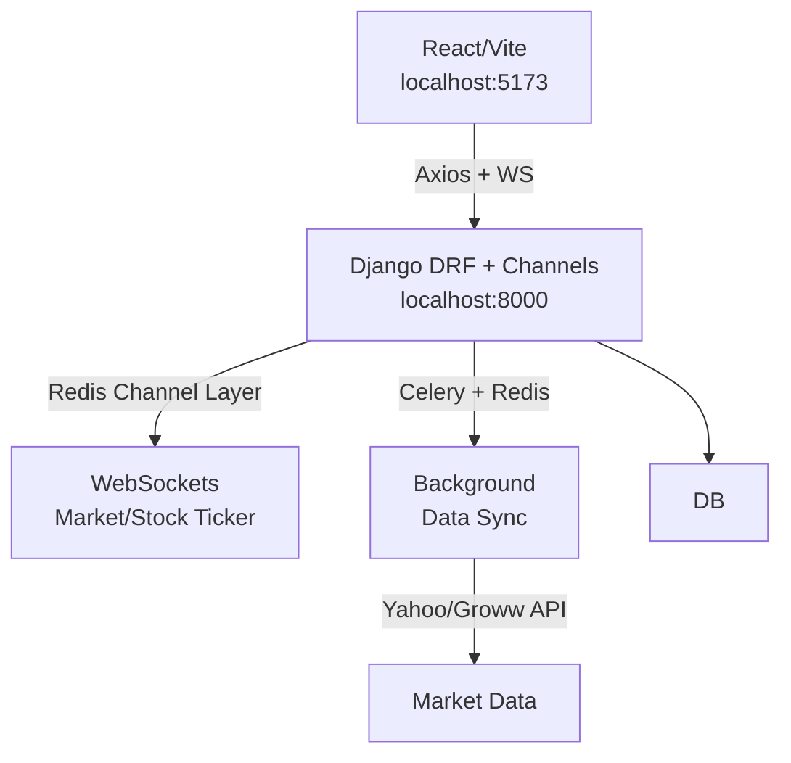

# 🤖 FundVision - Complete Financial Analysis Platform
[](https://www.djangoproject.com/)
[](https://vitejs.dev/)
[](https://www.django-rest-framework.org/)
[](https://channels.readthedocs.io/)

**Full-stack financial platform** with real-time market data, company analysis (P&L, Balance Sheet, Ratios), WebSocket live prices, user auth/watchlists, Celery tasks. Production-ready Django backend + modern Vite/React frontend.

## 🚀 Quick Start (Local Dev)

### Prerequisites
```bash
# MySQL 8+, Redis, Python 3.12+, Node 20+
git clone <repo>
cd c:/shiva/react/f1
```

### 1. Backend (Django)
```bash
cd fundvision_backend
python -m venv venv && venv\\Scripts\\activate  # Windows
pip install -r requirements.txt
cp .env.example .env  # Edit DB/Redis creds
python manage.py migrate
python manage.py seed_stocks
# Terminal 1: daphne -b 0.0.0.0 -p 8000 fundvision.asgi:application
# Terminal 2: celery -A fundvision worker -l info
# Terminal 3: celery -A fundvision beat -l info
```
**Backend runs:** http://localhost:8000/api/docs/ (Swagger)

### 2. Frontend (Vite + React)
```bash
cd ../fundvision_complete
npm install
npm run dev  # http://localhost:5173
```

### 3. Test Integration
- Search stocks → Company pages with live charts/WebSockets.
- Register/Login → Watchlist/Follow buttons.
- Market overview → Live Nifty/Sensex updates via ws://localhost:8000/ws/market/

## 📁 Structure
```
f1/                    # Monorepo root
├── README.md          # This file
├── .gitignore         # Python + Node coverage
├── fundvision_backend/ # Django REST API + Channels + Celery
│   ├── README.md      # [Detailed backend setup](fundvision_backend/README.md)
│   ├── manage.py
│   └── requirements.txt
└── fundvision_complete/ # Vite + React 18 + Tailwind/shadcn
    ├── README.md      # [Frontend quickstart](fundvision_complete/README.md)
    ├── package.json
    └── vite.config.ts
```

## 🏗️ Architecture



**Key Features:**
- **Real-time:** WS for market overview + per-stock prices.
- **Auth:** JWT, guest→login modal flow.
- **Data:** Financials (P&L/Balance/CashFlow/Ratios), peers, charts (Recharts).
- **Optimized:** N+1 prevention, Redis caching, indexed queries.

## 🔗 Detailed Guides
- [Backend: Setup/API/WebSockets/Celery](fundvision_backend/README.md)
- [Frontend: Components/Integration](fundvision_complete/README.md)
- [API Docs](http://localhost:8000/api/docs/) (live Swagger)

## Commands
```bash
# Status check
git status
cd fundvision_backend && python manage.py check --deploy
cd ../fundvision_complete && npm run build -- --watch

# Seed data
cd fundvision_backend && python manage.py seed_stocks
```

## 📈 Next Steps
- `git add fundvision_backend/ fundvision_complete/ && git commit -m "Add projects"`
- Deploy: Docker? Render/Vercel split?

---

⭐ **Star on GitHub if useful!**  
Built with ❤️ for financial analysis.

